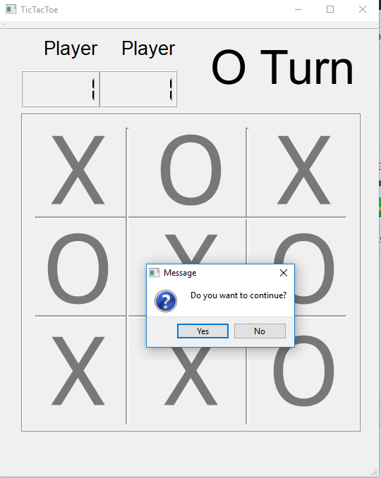

# My Other Repository
Please go check them out
\
Assignment 3: https://github.com/ukmerry/PIC10C-Assignment-3.git
\
Assignment 2: https://github.com/ukmerry/PIC10C-GradeCalculator.git
\
Assignment 1: https://github.com/ukmerry/PIC-10C-Assignment1.git

# Tic-Tac-Toe

THE GAME:
* Tic-tac-toe (American English), noughts and crosses (British English) or Xs and Os, is a paper-and-pencil game for two players, X and O, who take turns marking the spaces in a 3×3 grid. The player who succeeds in placing three of their marks in a horizontal, vertical, or diagonal row wins the game.

INSTRUCTION:
* The project is coded by using Qt creater. Players take turn to mark 'X' or 'O' on the grid until a winner is found and reward the winner with one score. Whenever a winner is found or the grid is full, the program will promt the user to continue or not.

# Guide

To start with, a two dimension array is created to store the 'X' and 'O'. The array is set to NULL as default indicating that it is waiting for input.

```c++
array<array<char, 3>, 3> grid;
```

Since we are having multiple signals that connect to similar slot, signalMapper is a good approach to handle all the signals and slots
.Group all the object button in an array so that we can identify which button is called

```c++
QPushButton *Button[9];
Button[0] = ui->pushButton_1;
Button[1] = ui->pushButton_2;
...
Button[8] = ui->pushButton_9;
```
Connect the signals and assign id's to each object button
```c++
connect(Button[0], SIGNAL(clicked()), signalMapper, SLOT(map()));
    signalMapper->setMapping(Button[0], 0);
connect(Button[1], SIGNAL(clicked()), signalMapper, SLOT(map()));
   signalMapper->setMapping(Button[1], 1);
...
connect(Button[8], SIGNAL(clicked()), signalMapper, SLOT(map()));
   signalMapper->setMapping(Button[8], 8);
```
Whenever signals of those buttons are caught, the function boxCliced( ) will be called
```c++
 connect(signalMapper, SIGNAL(mapped(const int&)), this, SLOT(boxClicked(const int&)));
``` 
\
*BoxClicked function*
\=========================================================================\
The boxclicked function can be divided into three parts
\
\
Part I: Output the result to the interface and change the flag to opposite for next input. \
Mark the boxes with 'x' or 'o' and then make the button unclickable
```c++
    if (flag == 'X' || flag == 0)
    {
        ui->label->setText("O Turn");
        Button[id]->setText("X");
        flag = 'O';
    }
    else if(flag == 'O' || flag == 0)
    {
        ui->label->setText("X Turn");
        Button[id]->setText("O");
        flag = 'X';
    }
    Button[id]->setEnabled(false);
```
Part II: Find the coordinate of the box corresponding to different id. \
Save the value to our 2-dimensional array
```c++
size_t i=0, j=0;
    switch(id)
    {
       case 0: i=0;j=0; break;
       case 1: i=0;j=1; break;
       case 2: i=0;j=2; break;
       case 3: i=1;j=0; break;
       case 4: i=1;j=1; break;
       case 5: i=1;j=2; break;
       case 6: i=2;j=0; break;
       case 7: i=2;j=1; break;
       case 8: i=2;j=2; break;
    }
     grid[i][j] = flag;
```
Part III: Check the result and pop out the result
```c++
if(win(i,j))
    {
        score(flag);
        reply = QMessageBox::question(this, flag+" win!", tr("Do you want to continue?"), QMessageBox::Yes|QMessageBox::No);
        if(reply == QMessageBox::Yes)
            reset();
        if(reply == QMessageBox::No)
            QApplication::quit();
    }
    else if(array_full())
    {
        reply = QMessageBox::question(this, "Draw!", tr("Do you want to continue?"), QMessageBox::Yes|QMessageBox::No);
        if(reply == QMessageBox::Yes)
            reset();
        if(reply == QMessageBox::No)
            QApplication::quit();
    }
 ```

\=========================================================================\
*Determine a winner*
\=========================================================================\
Traverse the array to see if the values are same
```c++
bool TicTacToe::win(size_t i, size_t j)
{
    char mark = grid[i][j];

//horizontal
    if (grid[i][0] == mark && grid[i][1] == mark && grid[i][2] == mark)
       return true;
//vertical
    if (grid[0][j] == mark && grid[1][j] == mark && grid[2][j] == mark)
       return true;
//diagonal
    if (grid[0][0] == mark && grid[1][1] == mark && grid[2][2] == mark)
       return true;
//diagonal
    if (grid[0][2] == mark && grid[1][1] == mark && grid[2][0] == mark)
       return true;

    return false;
}
```
\=========================================================================\
*reset function*
\=========================================================================\
The reset function clear the grid and enable all the buttons.
```c++
void TicTacToe::reset()
{
   for (auto it1 = std::begin(grid); it1 != std::end(grid); ++it1)
    {
        for (auto it2 = std::begin(*it1); it2 != std::end(*it1); ++it2)
            *it2 = '\0';
    }

    //make all boxes clickable and clear the arks
    for(auto it = std::begin(Button); it != std::end(Button); ++it)
    {
        (*it)->setEnabled(true);
        (*it)->setText("");
        (*it)->setPalette(Qt::white);
    }
}
```
# Process
The idea of creating Tictactoe is that tictactoe is an easy game that can determine a winner quickly. Whenever you are having a different idea with your friends, you can play this game with your friend to decide who can take the lead.
\
\
Deciding which container to use in this project was the first problem encountered. There are many choices such as vector, list, deque and array. I chose array because the size is fixed and there are no need to push new values to the container. I created a 2-dimension array because it is easier to locate which box we are looking for.
\
\
The biggest challenge in this project is to correctly connect each box signal to the right slot. My first appoarch is to connect the boxes to the slots one by one. But later on, I found this is super inefficient and time consuming because even a minor change of the algorithm would require me to change the corresponding slots one by one. I started to find a solution and came out that Qt library provides signalmapper to deal with this situation. Signalmapper is a very powerful tool that makes my life much more easier. Reference [https://doc.qt.io/archives/qt-4.8/qsignalmapper.html]
\
\
Last but least, I was trying to implement generic algorithm to replace all my for-loop. However, the array we are using is a 2-dimension array and a regular array does not provide iterator member function. Therefore, I used std::begin() and std::end() from the iterator library to obtain iterators. Then, dereference the iterator so that I can treat it as a regular class object and use its member function.
\
\
PIC10C concept used:
* std container (array)
* Git (version control)
* Qt (signals, slots, GUI design, etc)
* Generic algorithm and iterator (used in reset() and array_full() functions)
* Make file
# Comment
There are other helper functions that I did not mention because their syntax is simple. Also, I've done some of the stylesheet of my widgets. For instance, if you place your cursor on the grid, it will change to a hand shape cursor. The app is ready. If you are using Windows, there is a shortcut in the first page of the repository that you can lauch the app directly or you can go into [build-TicTacToe-Desktop_Qt_5_6_2_MinGW_32bit-Release](build-TicTacToe-Desktop_Qt_5_6_2_MinGW_32bit-Release/release) to find the .exe file.\
Codes are maily done in [tictactoe.h](TicTacToe/tictactoe.h) and [tictactoe.cpp](TicTacToe/tictactoe.cpp). Please check those two files.

# Sample Output

